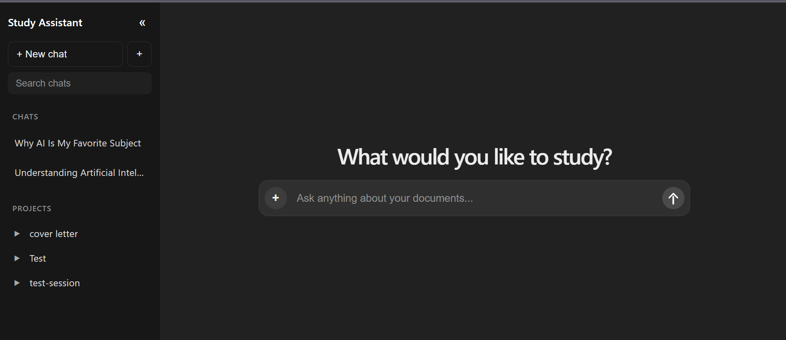

\# AI Study Assistant


An AI-powered study assistant that helps users interact with their study materials using Retrieval-Augmented Generation (RAG).

[](https://www.python.org/)
[](https://fastapi.tiangolo.com/)
[](https://react.dev/)
[](https://ai.google.dev/)
[](https://www.trychroma.com/)
[](#)

## 🖥️ Application Preview




\## 📌 Overview


AI Study Assistant is a full-stack AI application designed to help students understand and interact with their study materials.


Users can upload documents, ask questions about their content, and continue conversations through persistent chat sessions.


The application combines a React frontend, FastAPI backend, Google Gemini, ChromaDB, and SQLite to create a document-aware AI study experience.


\## ✨ Features


\* 📄 Upload study documents

\* 📝 Extract text from documents

\* ✂️ Split documents into manageable chunks

\* 🧠 Generate vector embeddings

\* 🔎 Semantic search and document retrieval

\* 🤖 Retrieval-Augmented Generation (RAG)

\* 💬 AI-powered question answering

\* 🗂️ Multiple chat sessions

\* 💾 Persistent chat history

\* 🔄 Reopen conversations after refreshing the application

\* 📚 Ask questions based on uploaded study material

\* ⚡ FastAPI backend

\* ⚛️ React frontend


\## 🏗️ Architecture


```text

&nbsp;                        AI STUDY ASSISTANT

&nbsp;                               │

&nbsp;                               ▼

&nbsp;                        React Frontend

&nbsp;                               │

&nbsp;                               ▼

&nbsp;                        FastAPI Backend

&nbsp;                               │

&nbsp;               ┌───────────────┴───────────────┐

&nbsp;               │                               │

&nbsp;               ▼                               ▼

&nbsp;      Document Processing                 Chat System

&nbsp;               │                               │

&nbsp;               ▼                               ▼

&nbsp;         Text Extraction                  SQLite

&nbsp;               │

&nbsp;               ▼

&nbsp;            Chunking

&nbsp;               │

&nbsp;               ▼

&nbsp;      Gemini Embeddings

&nbsp;               │

&nbsp;               ▼

&nbsp;           ChromaDB

&nbsp;               │

&nbsp;               ▼

&nbsp;      Relevant Document Chunks

&nbsp;               │

&nbsp;               ▼

&nbsp;           Gemini LLM

&nbsp;               │

&nbsp;               ▼

&nbsp;         Generated Answer

&nbsp;               │

&nbsp;               ▼

&nbsp;        React Frontend

```


\## 🔄 RAG Workflow


The application follows a Retrieval-Augmented Generation workflow.


\### 1. Document Upload


The user uploads study material through the React interface.


\### 2. Text Extraction


The FastAPI backend extracts text from the uploaded document.


\### 3. Text Chunking


The extracted text is divided into smaller chunks to make retrieval more efficient.


\### 4. Embedding Generation


The document chunks are converted into vector embeddings using Google Gemini.


\### 5. Vector Storage


The embeddings and associated document information are stored in ChromaDB.


\### 6. User Question


The user asks a question through the chat interface.


\### 7. Semantic Retrieval


The system searches the vector database to identify the most relevant document chunks.


\### 8. Context-Aware Generation


The retrieved information is provided to the Gemini language model as context.


\### 9. AI Response


Gemini generates an answer based on the retrieved context and the user's question.


\## 🛠️ Technology Stack


\### Frontend


\* React.js

\* JavaScript

\* CSS

\* Vite


\### Backend


\* Python

\* FastAPI

\* Uvicorn

\* Poetry


\### AI


\* Google Gemini

\* Gemini Embeddings

\* Retrieval-Augmented Generation (RAG)


\### Database \& Storage


\* ChromaDB

\* SQLite


\## 📂 Project Structure


```text

ai-study-assistant/

│

├── backend/

│   ├── app/

│   │   ├── ai/

│   │   │   ├── ai\_service.py

│   │   │   └── router.py

│   │   │

│   │   ├── api/

│   │   │   └── routes.py

│   │   │

│   │   └── main.py

│   │

│   ├── pyproject.toml

│   └── poetry.lock

│

├── frontend/

│   ├── src/

│   │   ├── App.jsx

│   │   ├── App.css

│   │   ├── index.css

│   │   └── main.jsx

│   │

│   ├── package.json

│   ├── package-lock.json

│   └── vite.config.js

│

├── docs/

│

├── .gitignore

└── README.md

```


\## 🔌 Backend API


The backend provides endpoints for AI functionality, document processing, and chat/session management.


Some of the implemented endpoints include:


```text

/ai/status

/ai/upload

/ai/extract

/ai/chunk

/ai/embed-test

/ask

/chat-history

/sessions

/documents

```


\## 🎯 Example Use Case


A student uploads a lecture document and asks:


> What are the main concepts discussed in this chapter?


The system retrieves the relevant sections of the uploaded material and provides them to the AI model as context.


The model then generates a natural-language answer based on the retrieved information.


\## 💡 Why RAG?


A general-purpose language model does not automatically know the contents of a user's private study materials.


RAG allows the application to connect an AI model with user-provided knowledge.


This makes the system useful for:


\* University lecture notes

\* Textbooks

\* Research papers

\* Course material

\* Assignments

\* Study guides

\* Personal notes


\## 🔐 Security


Sensitive configuration such as API keys is stored in environment variables and is excluded from the Git repository.


The `.env` file should never be committed or shared publicly.


\## 🚀 Future Improvements


Planned improvements include:


\* User authentication

\* Streaming AI responses

\* Source citations

\* Improved document parsing

\* Support for additional document formats

\* Conversation memory

\* Advanced RAG techniques

\* Retrieval evaluation

\* Improved UI/UX

\* PostgreSQL integration

\* Cloud deployment

\* Production-ready infrastructure


\## 📈 Project Goal


The goal of this project is to build a practical full-stack AI application while exploring:


\* Large Language Models

\* Retrieval-Augmented Generation

\* Vector databases

\* Semantic search

\* AI application architecture

\* Full-stack development

\* Document intelligence

## 🚀 Getting Started

Follow the steps below to run the AI Study Assistant locally.

### Prerequisites

Make sure the following are installed on your computer:

* Python 3.10+
* Poetry
* Node.js 18+
* npm
* Git
* A Google Gemini API key

### 1. Clone the Repository

```bash
git clone https://github.com/Azeem29742/ai-study-assistant.git
cd ai-study-assistant
```

### 2. Backend Setup

Open a terminal in the project directory and navigate to the backend:

```bash
cd backend
```

Install the Python dependencies using Poetry:

```bash
poetry install
```

### 3. Configure the Gemini API Key

Create a `.env` file inside the `backend` directory.

A template is provided in the repository:

```text
backend/.env.example
```

Create your `.env` file from the example.

On Windows PowerShell:

```powershell
Copy-Item .env.example .env
```

Then open `.env` and replace:

```env
GEMINI_API_KEY=your_gemini_api_key_here
```

with your actual Google Gemini API key:

```env
GEMINI_API_KEY=YOUR_ACTUAL_API_KEY
```

⚠️ Never upload your `.env` file or API key to GitHub.

### 4. Start the Backend

From the `backend` directory, start the FastAPI server:

```bash
poetry run uvicorn app.main:app --reload
```

The backend should be available at:

```text
http://127.0.0.1:8000
```

FastAPI API documentation is available at:

```text
http://127.0.0.1:8000/docs
```

### 5. Frontend Setup

Open a new terminal and navigate to the project:

```bash
cd ai-study-assistant/frontend
```

Install the frontend dependencies:

```bash
npm install
```

### 6. Start the Frontend

Run:

```bash
npm run dev
```

Vite will provide a local URL, usually:

```text
http://localhost:5173
```

Open that address in your browser.

### 7. Using the Application

Once both the backend and frontend are running:

1. Open the frontend in your browser.
2. Upload a study document.
3. Allow the application to process the document.
4. Ask questions about the uploaded material.
5. Create and switch between chat sessions.
6. Continue previous conversations using the chat history.

### Local Development Architecture

```text
Browser
   │
   ▼
React + Vite
   │
   ▼
FastAPI Backend
   │
   ├── Document Processing
   │
   ├── Gemini Embeddings
   │
   ├── ChromaDB
   │
   └── Gemini LLM
   │
   ▼
AI Response
   │
   ▼
React Frontend
```

### Troubleshooting

#### Backend does not start

Make sure you are inside the `backend` directory:

```bash
cd backend
```

Then run:

```bash
poetry run uvicorn app.main:app --reload
```

#### Frontend does not start

Make sure you are inside the `frontend` directory:

```bash
cd frontend
```

Install the dependencies:

```bash
npm install
```

Then start the development server:

```bash
npm run dev
```

#### Gemini API errors

Check that:

* Your `.env` file exists inside `backend`.
* `GEMINI_API_KEY` is correctly configured.
* Your Gemini API key is valid.
* The API key has not been accidentally exposed publicly.

\## 👨‍💻 Author


\*\*Azeem Ur Rehman\*\*


Software Engineer


Interested in Artificial Intelligence, LLMs, RAG systems, and AI automation.


---


⭐ If you find this project useful, consider giving the repository a star.


